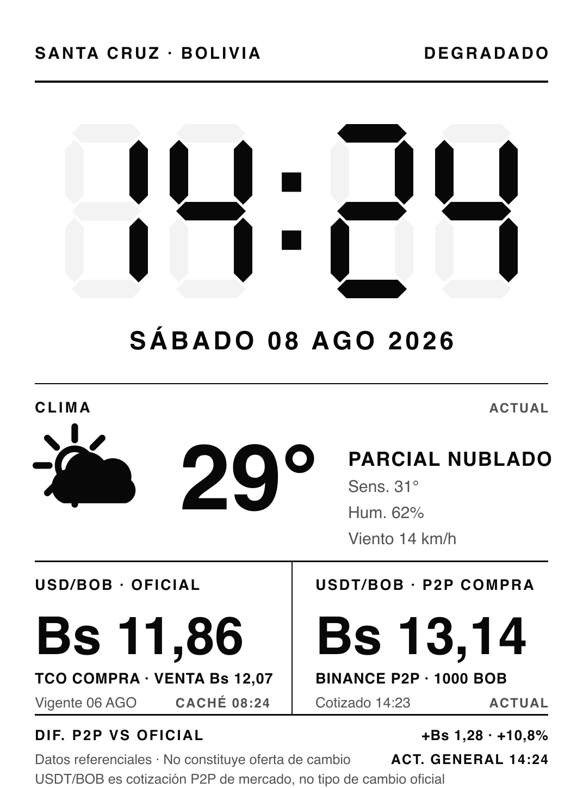

# Panel financiero de Bolivia para Kindle Paperwhite 4

[](LICENSE)
[](https://nodejs.org)
[](#verificación)

Convierte un **Kindle Paperwhite 10.ª generación con jailbreak** en un panel
de instrumentos e-ink (1072 × 1448 px, 300 ppi) que muestra hora y fecha
locales, el clima de la ciudad que elijas (se configura por coordenadas en
`.env`), el tipo de cambio oficial USD/BOB del BCB (vía
[CUCU](https://docs.cucu.bo/bcb/oficial)) y la cotización P2P de Binance para
**comprar USDT con BOB**. Verificado de punta a punta en un dispositivo real:
renderizado en la Mac, despliegue por SSH sobre Wi-Fi, pintado con FBInk.

¿Tu Kindle aún no tiene jailbreak? Aquí está la guía completa que se usó para
preparar este dispositivo (SpringBreak + KUAL + MRPI + USBNetworkLite +
FBInk): **[JAILBREAK_TUTORIAL.md](JAILBREAK_TUTORIAL.md)**.



> **Importante:** `USD/BOB · OFICIAL` es el tipo de cambio oficial (compra,
> BCB). `USDT/BOB · P2P COMPRA` es una cotización de mercado P2P de Binance;
> **no** es el dólar oficial y nunca se presenta como tal. Datos
> referenciales; nada aquí constituye oferta de cambio ni consejo financiero.

## Tabla de contenidos

1. [Arquitectura](#1-arquitectura-por-qué-se-renderiza-en-la-mac)
2. [Requisitos](#2-requisitos)
3. [Instalación](#3-instalación)
4. [Configurar .env](#4-configurar-env)
5. [Tutorial: de cero a panel funcionando](#5-tutorial-de-cero-a-panel-funcionando)
6. [Diagnóstico](#6-diagnóstico)
7. [Modo continuo](#7-modo-continuo)
8. [Cómo detenerlo](#8-cómo-detenerlo)
9. [Solución de problemas (casos reales)](#9-solución-de-problemas-casos-reales)
10. [Semántica de los datos](#10-semántica-de-los-datos)
11. [Personalización](#11-personalización)
12. [Seguridad](#12-seguridad)
13. [Contribuir y licencia](#13-contribuir-y-licencia)

## 1. Arquitectura: por qué se renderiza en la Mac

```
┌─────────── Mac ───────────┐        Wi-Fi LAN         ┌──── Kindle PW4 ────┐
│ fetch (3 APIs en paralelo)│                          │                    │
│  → validación (Zod)       │  ssh 'cat > tmp' + mv    │  screen.png        │
│  → caché last-known-good  │ ───────────────────────► │  fbink -g file=…   │
│  → SVG → PNG (Sharp)      │  (argumentos array)      │  (cliente delgado) │
└───────────────────────────┘                          └────────────────────┘
```

El Kindle es solo una pantalla: no corre Node, ni Sharp, ni navegador, ni
servidor web. La Mac obtiene los datos, dibuja el PNG y lo empuja por SSH
sobre Wi-Fi; FBInk lo pinta en el framebuffer. La operación normal **no usa
cable USB** (el USB queda para configuración inicial, recuperación o carga
con cargador de pared).

```
src/
  cli.ts                  comandos fetch/render/demo/diagnose/deploy/once/watch
  config.ts               .env validado con Zod (expande ~ en la ruta de clave)
  domain/                 modelo normalizado, frescura, formato es-BO
  providers/              http (timeout/retries), open-meteo, cucu, binance p2p
  cache/                  last-known-good atómico (.data/cache.json)
  render/                 SVG determinista: reloj 7 segmentos, iconos, Sharp
  kindle/                 ssh/fbink con arrays de argumentos, diagnóstico
  scheduler/              ciclo sin solapamiento, SIGINT/SIGTERM limpios
kindle-scripts/           Dashboard Start/Stop + extensión KUAL (reversibles)
```

## 2. Requisitos

- **Node.js 22+** en la Mac (probado también con Node 26).
- Kindle PW4 (u otro modelo ajustando dimensiones) con **jailbreak**,
  [USBNetworkLite](https://www.mobileread.com/forums/showthread.php?t=225030)
  y [FBInk](https://github.com/NiLuJe/FBInk) (probado con FBInk 1.25.0 en
  `/mnt/us/libkh/bin/fbink`, instalado por KindleHackers/libkh). Si partes de
  un Kindle sin modificar, sigue [JAILBREAK_TUTORIAL.md](JAILBREAK_TUTORIAL.md)
  — deja el dispositivo exactamente en el estado que este proyecto asume.
- Una clave SSH ED25519 cuya pública ya esté en
  `/mnt/us/usbnetlite/etc/dropbear/authorized_keys` del Kindle.
- Mac y Kindle en la **misma red Wi-Fi confiable**.

## 3. Instalación

```bash
git clone https://github.com/carlos-olivera/kindle-jailbroken-dashboard.git
cd kindle-jailbroken-dashboard
npm install
cp .env.example .env
```

Prueba inmediata sin red ni Kindle:

```bash
npm run demo
open artifacts/dashboard.png
```

## 4. Configurar `.env`

```dotenv
KINDLE_HOST=192.168.1.50             # IP Wi-Fi del Kindle (la descubrirás en el paso 5.4)
KINDLE_RECOVERY_HOST=192.168.15.244  # IP del enlace USB; solo recuperación
KINDLE_SSH_KEY=~/.ssh/kindle_pw4_ed25519
BINANCE_P2P_NOTIONAL_BOB=1000        # monto de referencia para filtrar avisos P2P
REFRESH_INTERVAL_MINUTES=5
FULL_REFRESH_EVERY=12                # flash completo cada N renders
```

La configuración se valida al arrancar; un valor con espacios o
metacaracteres en host/usuario/rutas remotas se rechaza (previene inyección
de comandos).

**Si tu clave SSH tiene passphrase** (recomendado), cárgala una vez en el
agente con el Llavero de macOS — el proyecto usa `BatchMode=yes` y no puede
pedir la passphrase interactivamente:

```bash
ssh-add --apple-use-keychain ~/.ssh/kindle_pw4_ed25519
```

## 5. Tutorial: de cero a panel funcionando

Esta secuencia está verificada en un PW4 real. Los pasos 5.1–5.5 se hacen una
sola vez.

### 5.1 Red USB estable (mientras configuras)

Al conectar el Kindle en modo USBNetwork, macOS crea una interfaz
"RNDIS/Ethernet Gadget" — pero **no le asigna IP** (no hay DHCP en ese
enlace) y sin ella todo dará timeout. Fíjala de forma permanente:

**Ajustes del Sistema → Red → RNDIS/Ethernet Gadget → Detalles… → TCP/IP**:

- Configurar IPv4: **Manualmente** (no "DHCP con dirección manual" — deja la
  máscara vacía y macOS aplica /32, rompiendo la ruta).
- Dirección IP: `192.168.15.201`
- **Máscara: `255.255.255.0`** ← imprescindible
- Router: vacío.

Verifica: `ifconfig | grep 192.168.15` debe mostrar `netmask 0xffffff00`.

### 5.2 Encender SSHD y probar por USB

En el Kindle: **KUAL → USBNetwork → Toggle USBNetwork**. Cada toque alterna
on/off — si dudas del estado, la prueba es un ssh:

```bash
ssh -o ConnectTimeout=8 -i ~/.ssh/kindle_pw4_ed25519 root@192.168.15.244 uname -a
```

- Responde `Linux kindle …` → encendido, sigue.
- `Connection refused` → SSHD apagado: un Toggle más.
- `Operation timed out` → problema de red en la Mac: revisa 5.1.

### 5.3 Activar SSH por Wi-Fi

Con el USB funcionando, haz respaldo y activa `USE_WIFI`:

```bash
ssh -i ~/.ssh/kindle_pw4_ed25519 root@192.168.15.244 \
  "cp /mnt/us/usbnetlite/etc/config /mnt/us/usbnetlite/etc/config.bak && \
   sed -i 's/^USE_WIFI=.*/USE_WIFI=\"true\"/' /mnt/us/usbnetlite/etc/config && \
   grep -E 'USE_WIFI|ALLOW_PASSWORD' /mnt/us/usbnetlite/etc/config"
```

Confirma en la salida: `USE_WIFI="true"` y `ALLOW_PASSWORD_LOGIN="false"`
(nunca expongas el puerto 22 en Wi-Fi con login por contraseña).

Qué hace este flag en USBNetworkLite (leído del script real): con `false`,
Dropbear se ata solo a `usb0`; con `true`, escucha en **todas** las
interfaces (USB incluida — no pierdes el cable) y el script añade la regla de
firewall `iptables -A INPUT -i wlan0 -p tcp --dport 22 -j ACCEPT` al arrancar
(el firmware trae política `DROP` para conexiones entrantes por Wi-Fi).

Ahora **reinicia USBNetwork para que lea la config**: KUAL → Toggle (off) →
Toggle (on). Tras cada toggle, un ssh de prueba te dice en qué estado quedó
(ver 5.2).

### 5.4 Descubrir la IP Wi-Fi y probar

En el Kindle, escribe `;711` en el buscador de la pantalla de inicio: se abre
el diagnóstico de red. Anota el `ipaddr` de **wlan0** (p. ej.
`192.168.50.68`). Alternativa: la lista de clientes DHCP de tu router.

```bash
ssh -o ConnectTimeout=8 -i ~/.ssh/kindle_pw4_ed25519 root@192.168.50.68 uname -a
```

Acepta la huella la primera vez (`yes`) — comprueba que coincide con la que
ya conocías del USB. Mantén el Kindle **despierto** durante la prueba: al
dormirse suspende el Wi-Fi.

Haz una **reserva DHCP** en el router para la MAC del Kindle, así la IP no
cambia y no tocas `.env` nunca más.

### 5.5 Apuntar el proyecto al Kindle y verificar

```bash
sed -i '' 's/^KINDLE_HOST=.*/KINDLE_HOST=192.168.50.68/' .env
npm run diagnose
```

`diagnose` verifica SSH, FBInk (imprime su `--help` real), el directorio
remoto y la propiedad del salvapantallas. La primera conexión registra la
huella en `.data/known_hosts` (estrategia `accept-new`, separada de tu
`~/.ssh/known_hosts`).

### 5.6 Primer despliegue con datos reales

```bash
npm run once     # fetch APIs → render → deploy → FBInk
```

En unos segundos el panel aparece en el Kindle con la hora actual de Santa
Cruz y las cotizaciones vivas. **Desconecta el cable USB** y repite
`npm run once` para confirmar que todo va por Wi-Fi.

Otros comandos útiles:

```bash
npm run fetch    # imprime el snapshot JSON sin desplegar
npm run render   # solo genera artifacts/dashboard.png con datos vivos
npm run deploy   # sube el PNG ya generado (no vuelve a hacer fetch)
```

### 5.7 Instalar Dashboard Start/Stop (mantener el Kindle despierto)

El salvapantallas corta el Wi-Fi. Los scripts de `kindle-scripts/` lo
previenen de forma **reversible** (activan `preventScreenSaver=1` guardando
el valor previo; Stop lo restaura). Súbelos una vez:

```bash
ssh -i ~/.ssh/kindle_pw4_ed25519 root@192.168.50.68 "mkdir -p /mnt/us/financial-dashboard /mnt/us/extensions/financial-dashboard"
ssh -i ~/.ssh/kindle_pw4_ed25519 root@192.168.50.68 "cat > /mnt/us/financial-dashboard/dashboard-start.sh && chmod +x /mnt/us/financial-dashboard/dashboard-start.sh" < kindle-scripts/dashboard-start.sh
ssh -i ~/.ssh/kindle_pw4_ed25519 root@192.168.50.68 "cat > /mnt/us/financial-dashboard/dashboard-stop.sh && chmod +x /mnt/us/financial-dashboard/dashboard-stop.sh" < kindle-scripts/dashboard-stop.sh
ssh -i ~/.ssh/kindle_pw4_ed25519 root@192.168.50.68 "cat > /mnt/us/extensions/financial-dashboard/config.xml" < kindle-scripts/kual-extension/financial-dashboard/config.xml
ssh -i ~/.ssh/kindle_pw4_ed25519 root@192.168.50.68 "cat > /mnt/us/extensions/financial-dashboard/menu.json" < kindle-scripts/kual-extension/financial-dashboard/menu.json
```

Aparecerá **Financial Dashboard** en KUAL con las entradas Start y Stop.

## 6. Diagnóstico

```bash
npm run diagnose                            # vía Wi-Fi (normal)
npm run diagnose -- --transport usb-recovery  # vía USB (emergencia)
```

También existe `scripts/kindle-diagnose.sh` (shell puro, sin Node). El
transporte USB de recuperación **nunca se selecciona solo**: siempre requiere
el flag explícito.

## 7. Modo continuo

En el Kindle: KUAL → Financial Dashboard → **Dashboard Start**. En la Mac:

```bash
npm run watch
```

Ejecuta un ciclo inmediatamente y luego cada `REFRESH_INTERVAL_MINUTES`
(5 min por defecto). Flash completo al inicio y cada `FULL_REFRESH_EVERY`
renders (12 por defecto) para evitar ghosting; entre medio, refresco sin
flash. Si un ciclo tarda más que el intervalo, el siguiente se **omite** (no
se encolan). Si una fuente falla, el panel muestra el último valor bueno
marcado `CACHÉ`/`ANTERIOR`; solo esa tarjeta se degrada.

> ⚠️ Mantener Wi-Fi + SSH despiertos gasta más batería. Para uso continuo se
> recomienda un **cargador de pared** (no un cable de datos a la Mac).

## 8. Cómo detenerlo

1. `Ctrl+C` en la Mac (`watch` termina el ciclo activo y sale limpio; también
   acepta `SIGTERM`).
2. En el Kindle: KUAL → **Dashboard Stop** — restaura `preventScreenSaver` al
   valor previo y devuelve el Kindle a su comportamiento normal. No queda
   nada activado.

Para desinstalar del Kindle: borra `/mnt/us/financial-dashboard/` y
`/mnt/us/extensions/financial-dashboard/`, y si quieres desactivar SSH por
Wi-Fi restaura `USE_WIFI="false"` (o `config.bak`) y haz un Toggle.

## 9. Solución de problemas (casos reales)

Todos estos casos ocurrieron durante la puesta en marcha del proyecto:

| Síntoma                                                                  | Causa real y solución                                                                                                                                                                                            |
| ------------------------------------------------------------------------ | ---------------------------------------------------------------------------------------------------------------------------------------------------------------------------------------------------------------- |
| `Operation timed out` por USB                                            | La Mac perdió su IP del enlace RNDIS (queda en `169.254.x.x`, o máscara /32 con "DHCP con dirección manual"). Solución permanente en §5.1                                                                        |
| `Connection refused` por USB                                             | La red está bien pero **Dropbear no corre**: el Toggle de KUAL quedó en off. Un Toggle y reintenta                                                                                                               |
| `Connection refused` por USB con `USE_WIFI` a medias                     | Versiones de este hack atan Dropbear a una sola interfaz según el flag; reinicia USBNetwork (Toggle ×2) tras cambiar la config                                                                                   |
| `Operation timed out` por Wi-Fi                                          | Firewall del Kindle: política `INPUT DROP` descarta SYN entrantes por wlan0. Con `USE_WIFI="true"` el propio script añade la regla al arrancar. Manual: `iptables -I INPUT -i wlan0 -p tcp --dport 22 -j ACCEPT` |
| `Connection refused` por Wi-Fi                                           | Dropbear apagado (toggle) o atado solo a usb0 (config con `USE_WIFI="false"`)                                                                                                                                    |
| `Permission denied (publickey)` desde el CLI pero el ssh manual funciona | La clave tiene passphrase y el proyecto usa `BatchMode=yes`. Cárgala en el agente: `ssh-add --apple-use-keychain ~/.ssh/tu_clave`                                                                                |
| `sh: scp: not found` al desplegar                                        | Este Dropbear no trae scp; el proyecto sube por streaming SSH (`cat > archivo`), no requiere scp remoto                                                                                                          |
| El panel muestra datos "viejos" tras `deploy`                            | `deploy` solo sube el último PNG generado. Para datos frescos usa `npm run once` (fetch + render + deploy)                                                                                                       |
| Kindle dormido no acepta SSH                                             | El salvapantallas corta Wi-Fi. Usa _Dashboard Start_ (KUAL) o toca la pantalla y reintenta                                                                                                                       |
| Cambió la IP (DHCP)                                                      | Actualiza `KINDLE_HOST` en `.env`; ideal: reserva DHCP en el router                                                                                                                                              |
| El AP aísla clientes (client isolation)                                  | Desactívalo o usa otra red; la Mac debe alcanzar el puerto 22 del Kindle                                                                                                                                         |
| El ping no responde                                                      | Normal: hay firmwares que no responden ICMP. Prueba TCP: `nc -z -G 5 <ip> 22`                                                                                                                                    |
| FBInk: ruta o flags distintos                                            | `npm run diagnose` imprime el `--help` real; ajusta `FBINK_PATH` o edita `src/kindle/fbink.ts` (una sola función, con tests)                                                                                     |
| APIs con timeout                                                         | Hay reintentos con backoff; si persiste, el panel usa el último valor bueno y lo marca `CACHÉ`/`ANTERIOR`                                                                                                        |
| Caché vieja o corrupta                                                   | Borra `.data/cache.json`; se regenera sola                                                                                                                                                                       |
| Recuperación total sin SSH                                               | Toggle a modo almacenamiento → el Kindle monta como disco USB → edita `/Volumes/Kindle/usbnetlite/etc/config` en el Finder (ahí está también `config.bak`)                                                       |

## 10. Semántica de los datos

- **USD/BOB · OFICIAL** — `tc_oficial.compra` del endpoint CUCU
  (`apibcb.cucu.bo/api/v1/tc/oficial`, fuente BCB). Se muestra `venta` en
  tipografía menor y la fecha de vigencia. En fines de semana/feriados se
  mantiene el último valor con su fecha visible; a las 72 h pasa a `ANTERIOR`.
- **USDT/BOB · P2P COMPRA** — cotización para **comprar USDT** pagando BOB en
  Binance P2P (endpoint público `quote-price`; si falla, mediana de los
  primeros avisos elegibles del `ad-list` público según
  `BINANCE_P2P_NOTIONAL_BOB`, prefiriendo comerciantes verificados). Solo
  lectura: sin claves de API, sin trading. **No es un tipo de cambio oficial
  ni una oferta ejecutable.**
- **Clima** — Open-Meteo (sin clave), con mapeo completo de códigos WMO a
  etiquetas en español e iconos SVG propios.
- **DIF. P2P VS OFICIAL** — diferencia aritmética entre ambos valores en Bs y
  porcentaje. Informativa; no implica arbitraje.
- Estados por tarjeta: `ACTUAL` (dato fresco), `CACHÉ HH:mm` (último valor
  bueno dentro de ventana), `ANTERIOR` (viejo pero visible), `SIN DATOS`
  (sin valor válido; se dibuja `—`, nunca `0,00`).
- Ventanas de frescura: clima 30 min/2 h; P2P 10 min/30 min; oficial por
  fecha de vigencia con límite operativo de 72 h.

## 11. Personalización

- **Ciudad**: se puede especificar la ciudad directamente con
  `LATITUDE`/`LONGITUDE` en `.env` (el clima usa esas coordenadas). El rótulo
  con el nombre de la ciudad se cambia en `src/render/render-dashboard.ts`.
- **Frecuencia**: `REFRESH_INTERVAL_MINUTES` y `FULL_REFRESH_EVERY`.
- **Monto P2P**: `BINANCE_P2P_NOTIONAL_BOB`.
- **Otro modelo de Kindle**: dimensiones en `src/render/palette.ts`
  (`CANVAS`), retícula en `src/render/layout.ts`, flags de FBInk en
  `src/kindle/fbink.ts`.
- **Tema visual**: tintas y grosores en `src/render/palette.ts`. Tipografía
  Inter ([OFL](assets/fonts/OFL-Inter.txt)) en `assets/fonts/`, cargada vía
  fontconfig propio — funciona en una Mac limpia sin fuentes instaladas.

## 12. Seguridad

- Autenticación **solo por clave pública**; el proyecto exige rutas/hosts
  validados y construye ssh con arrays de argumentos (sin shell, sin
  interpolación). Ver [SECURITY.md](SECURITY.md).
- Claves de host fijadas en `.data/known_hosts` (accept-new); nunca se
  desactiva la verificación.
- Todo string remoto se escapa antes de entrar al SVG (tests de inyección
  incluidos).
- Sin claves de API ni secretos: las tres fuentes son endpoints públicos de
  solo lectura. `.env`, `.data/` y claves están en `.gitignore`.
- No expongas el puerto 22 del Kindle fuera de tu LAN.

## Verificación

```bash
npm run check   # lint + typecheck + tests (77 tests)
npm run demo    # render sin red → artifacts/dashboard.{svg,png}
```

## 13. Contribuir y licencia

- Guía de contribución: [CONTRIBUTING.md](CONTRIBUTING.md) — reportes de
  compatibilidad con otros Kindles/builds de FBInk son especialmente
  bienvenidos (adjunta la salida de `npm run diagnose`).
- Seguridad: [SECURITY.md](SECURITY.md).
- Licencia: [Apache-2.0](LICENSE). La fuente Inter se redistribuye bajo
  [SIL OFL 1.1](assets/fonts/OFL-Inter.txt).

Proyecto sin afiliación con Amazon, Binance, el Banco Central de Bolivia,
CUCU ni Open-Meteo. Hecho para uso personal; jailbreakear tu Kindle es tu
responsabilidad.
